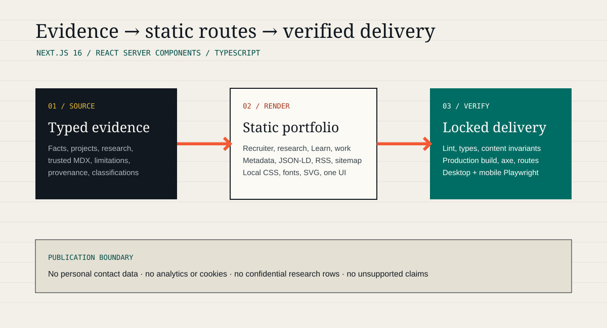

# ZQ Research Portfolio

The evidence-led portfolio for Mohd Zamin Quadri, focused on reliable machine learning,
Applied AI, graph neural networks, scientific computing, and MLOps engineering.

The site is built with Next.js 16, React 19, TypeScript, and a small CSS design system.
It is server-rendered and statically generated wherever possible. There is no analytics,
cookie, contact form, remote font, WebGL scene, or third-party client script. The one
interactive visual is a hand-written canvas 2D systems graph with a static server-rendered
fallback and no 3D dependency.

## Information Architecture

| Route | Purpose |
|---|---|
| `/` | Current focus, selected work, interactive systems graph, research, repository index, experience, capabilities, and writing |
| `/work` | Six written case studies plus a catalogued index of thirteen public repositories |
| `/work/[slug]` | Problem, contribution, workflow, evidence, quality controls, and limitations |
| `/research` | Research overview with primary, supporting, and emerging directions |
| `/research/thesis` | Progressive thesis record with methods, aggregate findings, interaction, limits, and provenance |
| `/learn` | Technical tutorials and notes backed by a typed local MDX collection |
| `/learn/[slug]` | Long-form technical content with code, equations, references, and related work |
| `/about` | Current status, working principles, and proof-linked capabilities |
| `/resume` | Canonical HTML resume generated from the approved truth and project models |
| `/contact` | Verified GitHub and LinkedIn; no personal-data collection |
| `/rss.xml` | RSS 2.0 feed for published technical content |

The retired `/drive` experiment redirects to `/work`. One redacted PDF export is generated
from `/resume`; it intentionally omits email, phone, address, identifiers, and disputed dates.

## Run Locally

Node 20 is required.

```bash
npm ci
npm run dev
```

Open `http://localhost:3000`.

## Verify

```bash
npm run check
npm run generate:resume
npx playwright install chromium
npm run test:e2e
```

`npm run check` runs lint, TypeScript, evidence/content validation, and a production build.
Playwright exercises all public routes at desktop and mobile sizes with reduced-motion
emulation and axe accessibility analysis.

## Content Integrity

Current public facts live in `src/content/truth.ts`; project evidence lives in
`src/content/portfolio.ts`; research protocols and aggregate values live in
`src/content/research.ts`; the public repository snapshot lives in `src/content/ecosystem.ts`;
current focus lives in `src/content/focus.ts`; long-form content lives in `content/writing`. `scripts/validate-content.ts` checks:

- source tiers, verification dates, review deadlines, and approved visibility;
- unique project slugs, authorship records, and valid proof links;
- evidence, quality controls, and limitations for every project;
- required routes and metadata endpoints;
- approved experience and education records, canonical resume paths, and omitted disputed dates;
- absence of public email, phone, stale CV paths, and selected unsupported claims.
- MDX metadata, publication dates, taxonomy consistency, project relationships, and privacy boundaries.
- research route ownership, pinned thesis provenance, distinct calibration protocols, and discrete selective-risk points.
- repository-index consistency: unique names, non-future commit dates, and agreement with each case study on the canonical repository URL.
- systems-graph integrity: every stage populated, every edge resolvable, and no link on a node that is only a direction of study.
- sanitized confidential-work descriptions, which may name no endpoint, host, or address.

Research figures and the focused selective-prediction interaction are site-native and use only
reviewed aggregate values. No raw
simulation data, row-level predictions, serialized models, confidential files, or local
filesystem paths are included. See `docs/EVIDENCE_AND_PRIVACY.md` for the publication
boundary.

The GitHub ecosystem is a reviewed static snapshot, not a live API integration: no route calls
GitHub at render time, no stars, forks, or contribution counts are published, and every page
renders identically when GitHub is unavailable. See `docs/GITHUB_ECOSYSTEM.md`.

## Architecture



The site uses React Server Components by default. Shared typed content and trusted local MDX feed static pages,
metadata, structured data, sitemap entries, and content validation. The only runtime
dependencies beyond Next.js and React are build/server-side content parsing and rendering tools.

## Deployment

Vercel installs the locked dependency graph with `npm ci` and runs `npm run check`.
Security headers disable framing, MIME sniffing, browser access to cameras, microphones,
and geolocation, and limit referrer disclosure.

## License

Website source is licensed under the [MIT License](LICENSE). Linked research repositories,
thesis material, data, models, and figures retain their own terms and are not relicensed by
this portfolio.
